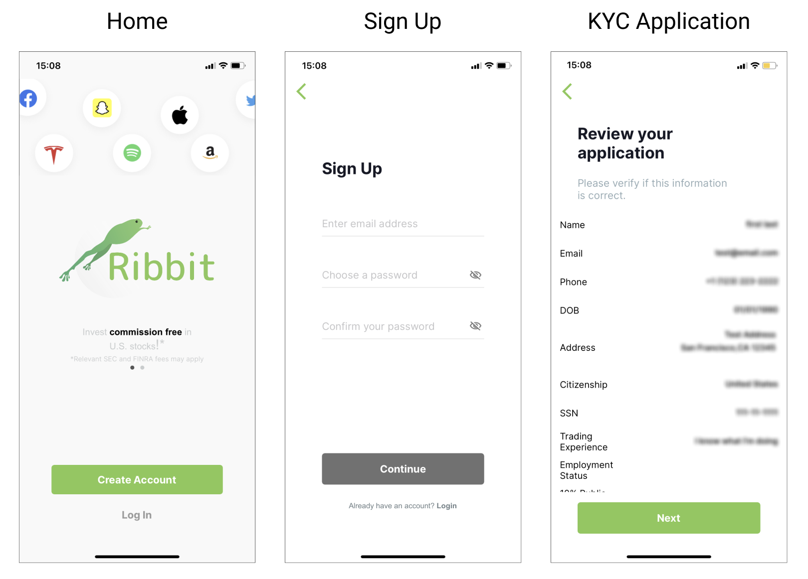
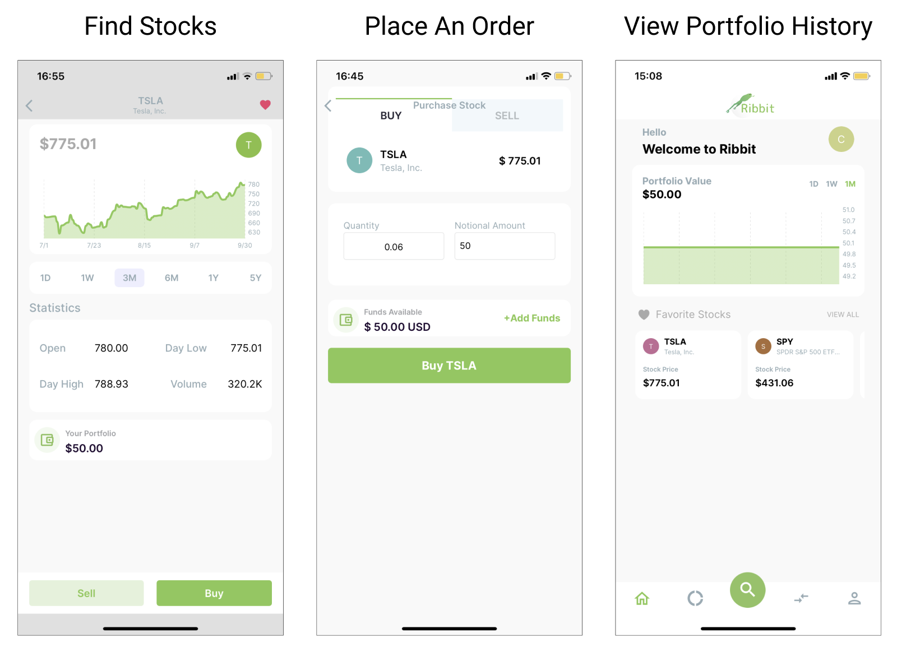

# Ribbit

## What is Ribbit?
Ribbit is a mobile app designed to showcase the capabilities of the Broker API. It's a fully functional broker-dealer trading application that demonstrates how users would interact with your product. It uses all the different functionality that the Broker API offers including onboarding new users, funding an account, managing market data, and handling trade activity. 

## Example user experience
The screenshots below demonstrate how a native user would walk through Ribbit to accomplish various tasks. 

### **Create a New Account**

### **Fund Your Account**

### **View Stocks and Execute Trades**

## Technology
The user interface is written in Swift for iOS and Java for Android. The backend is implemented using Go. 
### Alpaca APIs
All of the technology that is needed for users to interact with Ribbit's core functionality is acheived through the Broker API. Accessing information related to the market is gathered using the [Market Data API](http://localhost:1313/docs/broker/market-data/). 